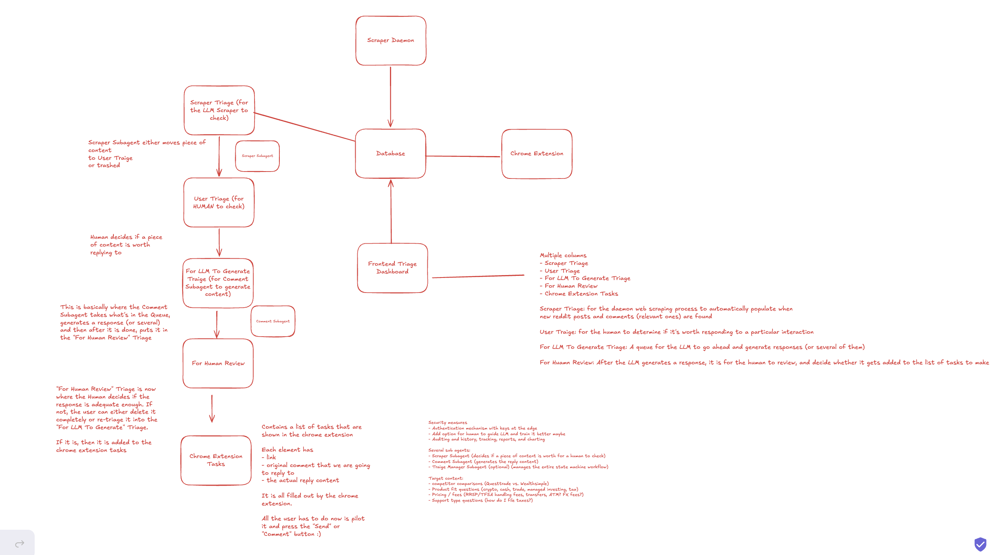

# plan

## Major Components

- Chrome extension (automatically fills in box with appropriate response)
- Main dashboard (web based)
- Daemon scraper
- Backend system (serves frontend runs the LLM, puts stuff into database)

## Defined lists

- subreddits
- key words in comments

## Subagents

- Filter Agent --> 2nd layer of the scraping process, determines whether something should be triaged or not
- Commenting Agent --> embedded in the chrome extension
- Triage Manager Subagent --> can be turned off. Automatically manages the triage from start to human review final stage.

## Overall Flow

Train an LLM to be understanding of WS's product line, market advantages and product-market fit
- LLM should NOT give out personal finance advice

scraper that scrapes selective various Reddit conversations, X conversations, YouTube comments
- LLM determines whether it is 

- 1. Web Scraper that adds new posts (from #defined-lists) to the scraper triage
- 2. Filter agent decides if it is worth a human reading and moves from scraper triage to user triage
- 3. User looks into the user triage and moves it into the generate column
- 4. In the generate column, they are sent to the commenting agent where it will generate a comment
- 5. Now they are in the "For Review" column where it will be viewable in both the dashboard and in the chrome extension
- 6. User can click on an element in the "For Review" column and it will bring the browser to the link, where clicking on the comment box will also
automatically fill it in and give you the option of pressing comment

## State Machine

1. Scraper Traige (for LLM Scraper to check)

This is where the scraper either moves a piece of content to user triage or is trashed.

2. User Triage (for human to check)

Human decides if a piece of content is worth replying to.

if not, it is trashed. If yes, it is moved to the generate column.

3. Generate (for LLM Commenting Agent to check)

This is where the commenting agent generates a comment for the piece of content.

4. For Review (for human to check)

This is where human decides if a response is adequate enough to be posted. If not, it is trashed. If yes, it is moved to the "Ready to Post" column.

5. Ready to Post (for Chrome Extension to check)

Contains a list of tasks for the Chrome Extension to check. If the user clicks on the comment box of the original content, it will automatically fill in the comment and give the user the option to post it.

For simplicity sake, we're going to call them:

1. Ingested
2. Opportunity Review
3. Drafting Queue
4. Approval Review
5. Ready to Publish

## Database

Database - Supabase Database

Multiple tables/silos:
- Scraper Triage
- User Triage
- Generate
- For Review
- Ready to Post
- Transactions (for logging/auditing purposes). 
Everytime a piece of content is moved from one silo to another,
it is logged in the transactions table with the content, the action taken,
the author of the action (either the LLM or the user), and the timestamp.
- Supabase Auth (for user management)
- Defined Lists (subreddits, key words in comments)
- Content Table (contains the original content that was scraped, along with metadata such as the source, author, timestamp, etc.)

## Arch Diagram

## Tech Stack

We're gonna use the best vibe coding tech stack out there:

Next.js + Supabase (Supabase Auth) + Tailwind + Vercel + OpenAI
